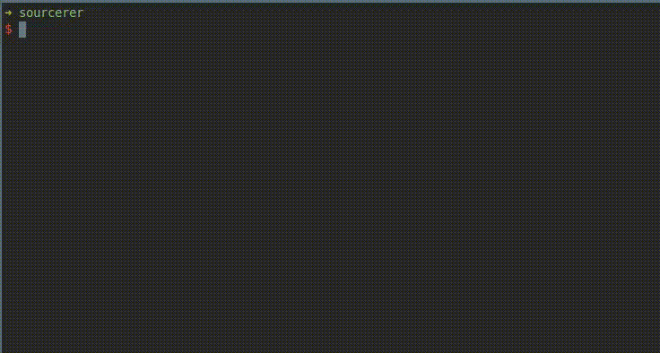

# sourcerer

A tool to automatically source a `.sourcerer` file in your shell when entering
this directory via `cd`.



## installation

`curl https://raw.githubusercontent.com/mstruebing/sourcerer/master/install.sh | bash`

This creates a `~/.sourcerer` directory with an `sourcerer` file in there.

## usage

`sourcerer` this will source the contents of a `.sourcerer`-file in the current d
working directory if such a file is present otherwise it's does nothing.

## automatic sourcing on `cd`

### zsh

If you are using `zsh` you could add this lines to the end of your `.zshrc`:

```
add-zsh-hook chpwd sourcerer
sourcerer
```

This will add an change directory hook that executes sourcerer on every `cd`
command and executes sourcerer when the shell starts.

Please make sure to add this __after__ the sourcing of 
sourcerer (`source /home/<username>/.sourcerer/sourcerer`)

### bash

If you are using `bash` you could add a function that first executes `cd`
and then executes sourcerer:

```
function cd() {
    builtin cd "$@" && sourcerer
}
```

Please make sure to add this __after__ the sourcing of 
sourcerer (`source /home/<username>/.sourcerer/sourcerer`)
